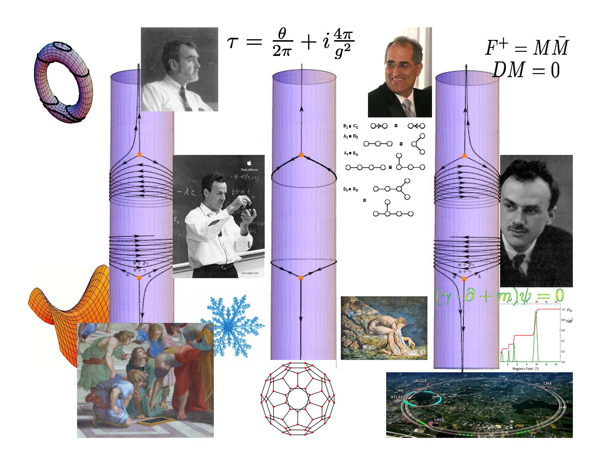

# MathNote / Mathematics Note

## 範疇（Category）

在大學數學系中，**範疇（Category）**通常是數學的一個高階分支，它屬於數學的抽象領域，主要用來研究數學結構及它們之間的關係。範疇論（Category Theory）起源於代數拓撲與代數幾何，但現如今已廣泛應用於數學的各個分支，甚至延伸到電腦科學、物理學等領域。

以下是範疇在數學系中的一些常見範疇與應用：

---

### 1. **範疇論的基礎概念**
- **範疇（Category）：** 
  包括對象（Objects）和態射（Morphisms，或箭頭），其中態射描述對象之間的關係，並需要滿足特定的合成性質。
  - 例子：集合範疇（Sets）中，對象是集合，態射是集合之間的函數。

- **函子（Functor）：**
  一種範疇之間的映射，它保持範疇結構（對象與態射的關係）。
  - 例子：從拓撲空間範疇映射到集合範疇的函子。

- **自然變換（Natural Transformation）：**
  連接函子之間的一種結構化的態射，表示函子之間的變換。

---

### 2. **範疇論在不同數學領域的應用**
- **代數結構：**
  - 模範疇：研究模（如向量空間）及其態射（如線性映射）。
  - 群範疇：研究群及群同態。

- **拓撲學：**
  - 研究拓撲空間及其連續映射的範疇。
  - 基點範疇用於代數拓撲中的基本群討論。

- **代數幾何：**
  - 使用概形（Schemes）作為對象，研究態射之間的關係。
  - 例如，仿射概形範疇描述仿射空間之間的幾何結構。

- **函數分析：**
  - Banach空間和線性算子的範疇，用於研究無窮維空間的性質。

---

### 3. **高級主題：範疇論的進一步發展**
- **高範疇（Higher Category）：**
  涉及態射之間的「態射」（即2態射、3態射），應用於現代物理學與同倫理論。

- **同倫範疇（Homotopy Category）：**
  研究空間與映射的同倫類別。

- **纖維範疇（Fiber Category）：**
  用於研究帶有額外結構的範疇，例如代數拓撲中的纖維叢。

---

### 4. **範疇論的應用範圍**
- **數學基礎：**
  範疇論為數學提供了一種統一的語言，可以用來描述多種數學結構。

- **計算機科學：**
  - 函數式編程語言（如Haskell）的基礎。
  - 理解與設計數據類型及抽象語法的範疇結構。

- **物理學：**
  - 量子場論與態射範疇。
  - 統一物理學中的數學結構（例如，拓撲量子場論）。

---

### 4. 大學數學系中的「範疇」涵蓋了多個不同的學科範疇，以下是一些詳細的範疇分類與描述，幫助你更全面地了解數學學科中的各種範疇：

---

### 1. **純數學範疇**
純數學側重於數學理論的探索，主要包括以下幾個領域：

#### (1) 代數學（Algebra）
- 群論、環論、域論：研究代數結構及其性質。
- 線性代數：向量空間、矩陣理論。
- 表現論：群、環等代數結構在向量空間中的表示。
- 同調代數：研究代數結構中的同調性。

#### (2) 數論（Number Theory）
- 初等數論：質數、整數分解、同餘理論。
- 分析數論：利用數學分析研究數論問題，如黎曼猜想。
- 代數數論：研究數域的代數性質，如類域理論。
- 算術幾何：結合數論和幾何，研究數學結構的整數解。

#### (3) 拓撲學（Topology）
- 一般拓撲：空間的基本性質，如緊緻性、連通性。
- 代數拓撲：利用代數工具研究拓撲空間的結構。
- 微分拓撲：研究流形及其微分結構。

#### (4) 幾何學（Geometry）
- 微分幾何：利用微分和積分工具研究曲面和流形。
- 代數幾何：研究多項式方程的幾何結構。
- 射影幾何：研究射影空間及其性質。

#### (5) 集合論與邏輯（Set Theory & Logic）
- 集合論：數學基礎，研究集合及其性質。
- 數理邏輯：研究形式化系統和邏輯推理。

---

### 2. **應用數學範疇**
應用數學側重於實際問題的數學建模與解決方案：

#### (1) 微分方程與動力系統（Differential Equations & Dynamical Systems）
- 常微分方程（ODE）：研究物理和工程中的時間變化系統。
- 偏微分方程（PDE）：流體力學、熱傳導等領域的核心工具。
- 動力系統：研究非線性系統的長期行為。

#### (2) 數值分析（Numerical Analysis）
- 數值方法：計算積分、解方程等的數值解法。
- 誤差分析：研究計算中的誤差及其影響。

#### (3) 機率與統計（Probability & Statistics）
- 機率論：隨機事件的數學分析。
- 統計學：數據分析與推斷方法。
- 隨機過程：如馬爾可夫鏈、布朗運動等。

#### (4) 優化與運籌學（Optimization & Operations Research）
- 線性規劃：如單純形法。
- 非線性規劃：處理更複雜的優化問題。
- 組合優化：如旅行推銷員問題。

#### (5) 數學物理（Mathematical Physics）
- 量子力學中的數學結構。
- 相對論與非歐幾何的聯繫。

---

### 3. **跨學科數學範疇**
數學與其他學科的交叉領域，拓展了數學的應用範圍：

#### (1) 計算數學（Computational Mathematics）
- 算法設計與分析。
- 數學建模與模擬。

#### (2) 金融數學（Financial Mathematics）
- 衍生品定價模型：如Black-Scholes公式。
- 風險管理中的數學方法。

#### (3) 數學生物學（Mathematical Biology）
- 人口動態模型、疾病傳播模型。
- 基因網絡與進化模型。

#### (4) 資訊理論與密碼學（Information Theory & Cryptography）
- Shannon信息理論。
- 公鑰密碼學與數論的應用。

#### (5) 數學教育（Mathematics Education）
- 數學教學理論與實踐。
- 解決學生對數學的學習障礙。

---

### 4. **現代數學的新興範疇**
新興數學領域往往反映了現代技術的進步與數學的進一步發展：

#### (1) 資料科學與機器學習（Data Science & Machine Learning）
- 數據分析中的矩陣分解與優化。
- 深度學習的數學基礎。

#### (2) 圖論與網絡科學（Graph Theory & Network Science）
- 社交網絡分析。
- 最短路徑、圖的著色等問題。

#### (3) 範疇論（Category Theory）
- 高範疇的發展與應用。
- 函數式編程中的範疇結構。

#### (4) 數學的哲學與基礎（Philosophy & Foundations of Mathematics）
- 無窮與直覺主義的哲學。
- 格羅滕迪克的範疇思想。

---

### 結語
範疇的分類展示了數學學科的廣度與深度。無論是純數學、應用數學還是跨學科數學，大學數學系的範疇提供了豐富的學術資源與研究方向，讓學生探索數學在理論與實踐中的無限可能性。

### 6. **學習建議**
- **基礎入門：**
  - 了解集合論和代數的基礎知識。
  - 推薦書籍：《Categories for the Working Mathematician》（Saunders Mac Lane）。
  
- **進階學習：**
  - 代數拓撲、同調代數、及代數幾何的應用。

範疇論是數學抽象的最高層次之一，適合對數學結構和形式化語言感興趣的學生深入研究。

## Computer Algebra

以下是一些常見的電腦代數系統（Computer Algebra Systems，CAS）：

1. **Maxima**：一個開源的電腦代數系統，源自於1960年代麻省理工學院開發的Macsyma，提供符號和數值計算功能。 citeturn0search9

2. **SageMath**：一個開源的數學軟體，整合了多種數學工具，提供統一的Python介面，適用於代數、幾何、數論等領域。

3. **Wolfram Mathematica**：一個商業數學軟體，提供廣泛的符號和數值計算功能，適用於科學、工程和數學研究。 citeturn0search8

4. **Maple**：一個商業數學軟體，專注於符號計算和數值分析，廣泛應用於教育和研究領域。

5. **SymPy**：一個用Python編寫的開源符號計算庫，適用於符號數學運算。

6. **FriCAS**：一個先進的開源電腦代數系統，功能涵蓋微積分、抽象代數等，並提供繪圖和整合的幫助系統。 citeturn0search4

7. **Axiom**：一個通用的電腦代數系統，具有強大的類型系統和編程語言，適用於數學研究和算法開發。

8. **Reduce**：一個交互式系統，適用於一般代數計算，廣泛應用於數學家、科學家和工程師。

9. **GAP**：一個專注於計算離散代數，特別是群論的系統，適用於數學研究和教育。

10. **CoCoA**：一個專門用於計算多變量多項式的開源軟體，適用於交換代數研究。

這些系統在功能、使用者介面和應用領域上各有特色，使用者可根據需求選擇合適的工具。

**時間點**：2024年11月3日，星期日，20:04:32（美國東部時間）

**Markdown格式**：

```markdown
以下是一些常見的電腦代數系統（Computer Algebra Systems，CAS）：

1. **Maxima**：一個開源的電腦代數系統，源自於1960年代麻省理工學院開發的Macsyma，提供符號和數值計算功能。 citeturn0search9

2. **SageMath**：一個開源的數學軟體，整合了多種數學工具，提供統一的Python介面，適用於代數、幾何、數論等領域。

3. **Wolfram Mathematica**：一個商業數學軟體，提供廣泛的符號和數值計算功能，適用於科學、工程和數學研究。 citeturn0search8

4. **Maple**：一個商業數學軟體，專注於符號計算和數值分析，廣泛應用於教育和研究領域。

5. **SymPy**：一個用Python編寫的開源符號計算庫，適用於符號數學運算。

6. **FriCAS**：一個先進的開源電腦代數系統，功能涵蓋微積分、抽象代數等，並提供繪圖和整合的幫助系統。 citeturn0search4

7. **Axiom**：一個通用的電腦代數系統，具有強大的類型系統和編程語言，適用於數學研究和算法開發。

8. **Reduce**：一個交互式系統，適用於一般代數計算，廣泛應用於數學家、科學家和工程師。

9. **GAP**：一個專注於計算離散代數，特別是群論的系統，適用於數學研究和教育。

10. **CoCoA**：一個專門用於計算多變量多項式的開源軟體，適用於交換代數研究。

這些系統在功能、使用者介面和應用領域上各有特色，使用者可根據需求選擇合適的工具。

**時間點**：2024年11月3日，星期日，20:04:32（美國東部時間）
```

**RSS格式**：

```xml
<?xml version="1.0" encoding="UTF-8" ?>
<rss version="2.0">
  <channel>
    <title>電腦代數系統列表</title>
    <link>http://example.com/</link>
    <description>常見的電腦代數系統介紹</description>
    <item>
      <title>Maxima</title>
      <link>https://maxima.sourceforge.io/</link>
      <description>一個開源的電腦代數系統，源自於1960年代麻省理工學院開發的Macsyma，提供符號和數值計算功能。</description>
    </item>
    <item>
      <title>SageMath</title>
      <link>https://www.sagemath.org/</link>
      <description>一個開源的數學軟體，整合了多種數學工具，提供統一的Python介面，適用於代數、幾何、數論等領域。</description>
    </item>
    <item>
      <title>Wolfram Mathematica</title>
      <link>https://www.wolfram.com/mathematica/</link>
      <description>一個商業數學軟體，提供廣泛的符號和數值計算功能，適用於</description>

```

## Physical Mathematics


[Magnetic field -(https://en.wikipedia.org/wiki/Linking_number)](https://en.wikipedia.org/wiki/Linking_number#Gauss's_integral_definition)

[Physical_mathematics-(https://en.wikipedia.org/wiki/Physical_mathematics)](https://en.wikipedia.org/wiki/Physical_mathematics)

[Topological quantum field theory(https://en.wikipedia.org/wiki/Topological_quantum_field_theory)](https://en.wikipedia.org/wiki/Topological_quantum_field_theory)

- Topological quantum field theory (or topological field theory or TQFT) is a quantum field theory which computes topological invariants."

[Quantum Invaraint(https://en.wikipedia.org/wiki/Quantum_invariant)](https://en.wikipedia.org/wiki/Quantum_invariant)

[Gregory W. Moore(https://www.physics.rutgers.edu/~gmoore/)](https://www.physics.rutgers.edu/~gmoore/)


